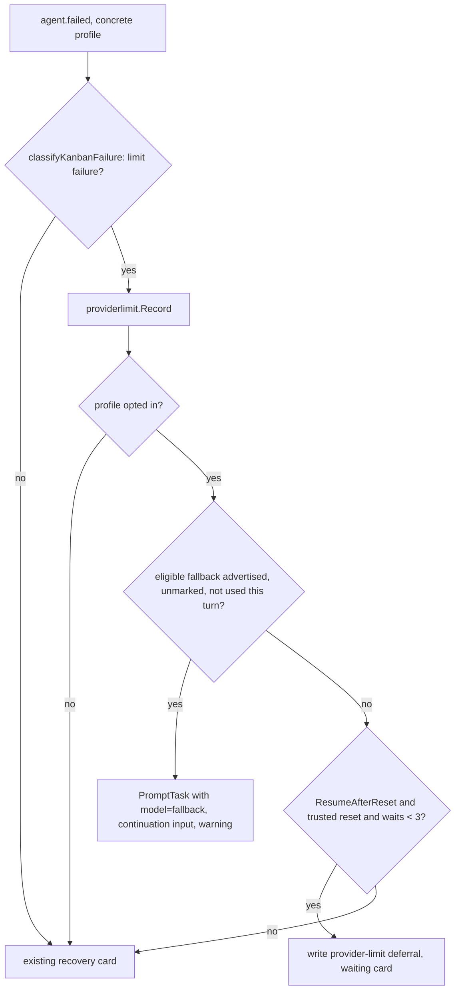

# Provider Limit Recovery System Design

## Purpose and boundaries

Agents owns limit classification, the per-profile limit policy, and the shared
limit marks. Tasks (the orchestrator) and Office consume them. Each consumer
keeps ownership of its own session, run, and scheduling state.

This design reuses existing contracts and adds no parallel mechanism:

- `routingerr` classification and reset parsing
  ([provider-neutral recovery](../../../decisions/2026-08-08-provider-neutral-agent-error-recovery.md)).
- The credential binding fingerprint and resource circuit registry from
  [dynamic routing](dynamic-agent-routing-01.md). They are used here without
  the `features.dynamicAgentRouting` gate.
- The Kanban model-switch prompt path and the durable `model_selection_warning`
  status message ([no silent model fallback](no-silent-model-fallback-01.md)).
- The shared task `deferred_launch` record and its replay kinds from the
  [session concurrency ceiling](../requirements/session-concurrency-ceiling.md).
- Office run parking, `earliest_retry_at`, and parked-run lifting.

Dynamic profiles are excluded. `handleTransientFailure` and
`routeDynamicAgentFailureWithEvidence` keep owning dynamic sessions.

## Requirement mapping

| Requirement | Design section |
| --- | --- |
| `REQ-AGENTS-PROVIDER-LIMIT-RECOVERY-001` | [Profile policy](#profile-policy) |
| `REQ-AGENTS-PROVIDER-LIMIT-RECOVERY-002` | [Limit marks](#limit-marks) |
| `REQ-AGENTS-PROVIDER-LIMIT-RECOVERY-003` | [Kanban failure flow](#kanban-failure-flow) |
| `REQ-AGENTS-PROVIDER-LIMIT-RECOVERY-004` | [Kanban failure flow](#kanban-failure-flow), [Deferred work and waking](#deferred-work-and-waking) |
| `REQ-AGENTS-PROVIDER-LIMIT-RECOVERY-005` | [Automatic launch gate](#automatic-launch-gate) |
| `REQ-AGENTS-PROVIDER-LIMIT-RECOVERY-006` | [Office runs](#office-runs) |
| `REQ-AGENTS-PROVIDER-LIMIT-RECOVERY-007` | [Classification evidence](#classification-evidence) |

## Harness evidence

Kandev receives only what each harness puts on the ACP boundary. Provider HTTP
headers do not cross that boundary unless the harness copies them into the
error message or data.

| Harness | Observed or documented report | Current handling | Change |
| --- | --- | --- | --- |
| `claude-acp` subscription | `You've hit your session limit · resets 11:10am (Europe/Helsinki)` | `quota_limited`, clock reset (#4135) | account scope |
| `claude-acp` API key | `429 {"type":"error","error":{"type":"rate_limit_error",...}}`; `retry-after` (seconds), `retry-after-ms`, RFC 3339 `anthropic-ratelimit-*-reset`; spend ceiling: `monthly spend limit`, `enforced_spend_limit_reached` | `rate_limited` via `rate.?limit`; no delay; spend text unclassified | delay extraction; spend as account quota |
| `claude-acp` credits | `credit balance`, `insufficient credits` | `quota_limited` | account scope |
| `omp-acp` (Anthropic models) | assistant `agent_message_chunk` holding `429 {"type":"error","error":{"type":"rate_limit_error","message":"This request would exceed your account's monthly spend limit. ..."},"request_id":"req_..."} retry-after-ms=274579000`; `session/prompt` then returns `end_turn` with no RPC error or stderr (observed with OMP 18.5.0 against a fake endpoint) | ordinary completed output; `Classify` with `omp-acp` gives `agent_runtime_error` | prompt-end failure conversion; spend gives account quota scoped to the `anthropic` provider prefix; exact-ms delay; request ID redacted |
| `codex-acp` | `usageLimitExceeded`, `You've hit your usage limit ... try again at <date>` | `quota_limited`; zoned dates only (#4019) | account scope |
| `codex-app-server` | `account/rateLimits/updated` windows with `resetsAt` | not classified | out of scope; needs a captured failure fixture |
| `opencode-acp` | stderr `N-hour usage limit reached ... Resets in 3 days 4 hours`, credit exhaustion | `quota_limited`, minute-precision reset (#2167, #3320, #4078) | account scope |
| `gemini` | `429 RESOURCE_EXHAUSTED`, `exceeded your current quota`, `retryDelay "34s"`, `Please retry in 41.5s` | no rule | model-scope quota plus delay |
| `copilot-acp` | `rate limit`; premium allowance exhaustion; the harness may switch to its base model on its own | `rate_limited` | model scope; harness fallback is reported, not repeated |
| `amp-acp` | `rate limit`, `quota` | rate, medium-confidence quota | model scope |
| Others (Cursor, Droid, Auggie, Antigravity, Qwen, ...) | no captured fixture | `agent_runtime_error` | none; needs evidence |

The Anthropic, Gemini, and Copilot formats come from provider documentation
and public reports. The `retry-after-ms` example comes from the issue reporter.
Rules ship only with a fixture that reproduces the observed text.

## Components and responsibilities

| Component | Location | Responsibility |
| --- | --- | --- |
| Classifier | `internal/agent/runtime/routingerr` | Code, limit scope, and reset from evidence |
| ACP projection | `internal/agentctl/server/adapter/transport/acp/opencode_stderr.go` (`ProviderErrorFromError`), `adapter_prompt.go`, `adapter_updates.go` | Allowlisted retry-delay extraction; OMP prompt-end failure conversion |
| Provider error stream | `internal/agentctl/types/streams/provider_error.go` | Carries `RetryAfterMs` |
| Profile policy | `internal/agent/settings/{models,dto,store,handlers}`, `lifecycle/profile_resolver.go` | Settings persistence and the eligibility function |
| Limit marks | new `internal/agent/runtime/providerlimit` | Binding and scope keys, record, lookup, clear, probe, list |
| Circuit store | `internal/agent/runtime/dynamic/circuit.go`, Task `dynamic_resource_circuits` | Durable mark storage |
| Kanban consumer | `internal/orchestrator` (new `provider_limit_*.go`) | Failure handling, launch gate, deferral, waking |
| Office consumer | `internal/office/service/event_subscribers.go`, `internal/office/scheduler` | Requeue, park, lift, dispatch gate |
| Web | profile settings, agent profile rows, `task/chat/messages/action-message.tsx` | Switches, indicators, waiting card |

## Classification evidence

`routingerr.Error` gains `LimitScope` (`account`, `model`, or empty). A rule
declares its scope. `applyInvariants` sets `model` for every `quota_limited` or
`rate_limited` result without a declared scope. Account rules are
`claude.stderr.session_limit.v1`, `claude.stderr.quota.v1`, a new
`claude.stderr.spend_limit.v1`, Codex quota, and OpenCode usage and credit
rules.

`routingerr.Input` gains `RetryAfter time.Duration`. Reset precedence in
`Classify` (AC 007.1):

1. `Input.ResetHint` (absolute, structured).
2. `Input.OccurredAt + Input.RetryAfter`, from a millisecond or seconds delay.
3. A text-derived reset (existing parsers, then the new delay text patterns).

`streams.ProviderError` gains `RetryAfterMs *int64`.
The `RetryAfterMs` field holds the delay in exact milliseconds. The generic ACP
projection fills it only from these sources:

- `acp.RequestError.Data` keys `retry_after_ms`, `retryAfterMs`, or
  `retry-after-ms`, or a `headers` object holding them.
- `retry-after` in seconds.
- Gemini `retryDelay` (`<n>[.<f>]s`).
- Bounded message text matching `retry-after-ms[=:\s]+(\d{1,12})` or
  `Please retry in <n>[.<f>]s`.

A delay must be positive and convert without overflow to `time.Duration`
(`RetryAfterMs <= math.MaxInt64 / int64(time.Millisecond)`); values outside
that representable range are dropped. Seven days is not the parsing limit: a
larger valid delay produces a known reset and mark expiry, but it is not a
trusted reset for automatic waits or deferrals. Seconds and fractional seconds
convert to milliseconds exactly; nothing rounds a millisecond value.
`classifyKanbanFailure` and Office `HandlePostStartFailure` pass the delay
through as `Input.RetryAfter`.

New rules:

- `claude-acp`: `claude.stderr.spend_limit.v1`, matching
  `(?i)spend limit|enforced_spend_limit_reached`, gives `quota_limited`, high
  confidence, account scope. It is ordered before the rate rule because spend
  errors use the type `rate_limit_error`.
- `gemini`: `gemini.stderr.quota.v1`, matching
  `(?i)resource_exhausted|exceeded your current quota`, gives `quota_limited`,
  model scope.
- `omp-acp`: `omp.chunk.anthropic_spend.v1` (ordered first) and
  `omp.chunk.anthropic_rate.v1`. They match only the converted OMP diagnostic
  below, never generic prose. Spend gives account-scope `quota_limited`;
  other Anthropic `rate_limit_error` envelopes give `rate_limited`.

### OMP prompt-end failure conversion

OMP has no Kandev dialect. It emits a provider failure as an assistant
`agent_message_chunk`, then returns `end_turn`. The adapter already converts
prompt-end evidence for Cursor (`cursorRetriableFailureAt`) and Codex
(`codexCapacityFailure`) in `adapter_prompt.go`. OMP adds a third branch in
the same place:

- `adapter_updates.go` marks an `omp-acp` chunk as a candidate only when its
  trimmed text is `429 ` followed by a strict JSON object with
  `type == "error"` and `error.type == "rate_limit_error"`. An optional
  `retry-after-ms=<digits>` suffix is allowed. Any later assistant chunk in the
  same prompt clears the candidate (AC 007.5).
- At prompt end, a candidate that is still current emits `EventTypeError`
  with a `ProviderError`:
  - `Source`: the new `omp_acp`.
  - `ProviderID`: `omp-acp`.
  - `ModelID`: the session's current model.
  - `Message`: the sanitized `error.message`.
  - `RetryAfterMs`: the parsed suffix.
  - `OccurredAt`: the chunk time.

  It cancels the async completion, as the Codex branch does. Other agents and
  non-candidate turns keep the completion path.
- The conversion applies to every OMP profile, opted in or not. A spend
  limit becomes a failed turn with the existing recovery card instead of a
  "completed" turn whose answer is an error JSON. This is a deliberate visible
  change for OMP users and is called out in the plan.
- `sanitize.go` and `streams/provider_error.go` add `req_` to the known
  provider-identifier redaction set (AC 007.6). The OMP fixture proves that
  the request ID is absent while the number survives in `RetryAfterMs`.

## Profile policy

`models.AgentProfile` gains `LimitFallback bool` (`db:"limit_fallback"`) and
`ResumeAfterReset bool` (`db:"resume_after_reset"`). Additive migrations add
both columns as `INTEGER NOT NULL DEFAULT 0` (SQLite) and the matching boolean
columns (Postgres). The DTO and profile contract expose `limit_fallback` and
`resume_after_reset`. The update request uses pointer fields so an omitted
value keeps the saved one. Duplication, export, and import copy both fields.
Dynamic profile writes reject them (AC 001.6).

One function owns eligibility:

```go
// lifecycle (or providerlimit) package
type LimitPolicy struct {
    FallbackModel    string // eligible limit fallback, or ""
    ResumeAfterReset bool
}
func LimitPolicyFor(p *AgentProfileInfo) LimitPolicy
```

`FallbackModel` is not empty only when `LimitFallback` is on,
`RequireExactModel` is off, `AutoFallback` is off, and `FallbackModel` is not
empty. `AgentProfileInfo` gains the two booleans through `profile_resolver.go`.

The web forms are `cli-profile-editor.tsx` with `cli-profile-fallback-fields.tsx`
and the settings page `profile-model-fields.tsx`. Both add two switches inside
`ModelFallbackSettingsShell`. The fallback switch is disabled under the same
predicate as the explicit fallback controls. `agent-profile-dirty.ts`,
`agent-profile-page-state.ts`, `agent-profile-reconciliation.ts`, and
`agent-save-helpers.ts` carry the fields, and the shell summary adds a
limit-recovery clause. All copy uses `settings:*` keys in all seven locales.

## Limit marks

Package `providerlimit` wraps the shared `*dynamic.CircuitRegistry`, which is
created and restored in `backendapp/services.go`.

- **Binding:** `dynamic.CredentialBindingResolver.Resolve(descriptor,
  profileID)`. The descriptor comes from the existing
  `profileCredentialBindingDescriptor`, which moves from
  `agent/runtime/dynamic_resolver.go` into package `dynamic` and is exported.
  An unprovable descriptor resolves to `profile:<id>` (AC 002.4).
- **Keys:** `limit|<binding>|account`, or for provider-qualified agents
  `limit|<binding>|account|<provider>`, and `limit|<binding>|model|<modelID>`.
  An agent declares provider-qualified model IDs (`<provider>/<model>`)
  through a capability on its definition in `internal/agent/agents`. The
  capability is true for `omp-acp` and `opencode-acp`. The provider is the
  failed model's prefix; an identifier without a prefix records model scope
  (AC 002.9). The binding is already an opaque HMAC or profile key. Model IDs
  are product identifiers.
- **Record(subject, err, observedAt):** For a limit failure, the code selects
  the key. Expiry is the classified reset (whether or not it is trusted), or
  `observedAt + 30m` when no reset is known. The mark is written through
  `CircuitRegistry.Open(key, until, code)`. A later expiry extends a mark; an
  earlier one never shortens it.
- **Lookup(subject, model):** Returns the latest active mark among the
  account key that applies to the model (provider-qualified when the agent
  declares it) and the model key. It also returns `ResetKnown` and `Until`.
- **ClearOnSuccess(subject, model):** Closes the applicable account key and
  the model key (AC 002.5).
- **Probe:** `AcquireProbe(key, 10*time.Minute)` and `ReleaseProbe(lease,
  success, 0)` (AC 002.6). When the probe fails with a new limit, `Record`
  reopens the circuit with the new reset.
- **List():** Returns active marks for the API.

Registry additions:

- `CircuitSnapshot.ResetKnown bool`, persisted in a new
  `dynamic_resource_circuits.reset_known` column (additive, default 0).
- `Close(key)`.
- `List(prefix)`.

Dynamic routing does not read `limit|` keys, so the two uses do not interact.

The API is `GET /api/v1/agent-profiles/limits`. It returns `[{profile_id,
model, scope, until, reset_known}]`, computed for each concrete profile from
its binding and model. A mark change broadcasts the WebSocket notification
`agent.profile.limits_updated`. A web store slice under the agents settings
state feeds the `limited until` pill in the profile row of
`agent-profiles-section`.

## Kanban failure flow

`handleAgentFailedLocked` keeps its order. It filters stale failures, then
runs `handleTransientFailure`, then routes dynamic sessions. A new
`handleProviderLimitFailure(ctx, data) bool` runs before
`handleRecoverableFailureLockedState`:



- **Advertised check:** Uses the execution's `CachedModelState`, refreshed by
  `session_models` and read through the lifecycle manager. A missing catalog
  means the fallback is not advertised (AC 003.4).
- **Continuation input (AC 003.2):** If the dynamic evidence reports no turn
  event for the failed generation, the input is the captured
  `lastTurnPrompt`, or else the persisted user message for that turn.
  Otherwise it is the fixed agent-facing instruction
  `providerLimitContinuationPrompt`.
- **Switch:** Uses `promptTask` with `launchOriginAutomatic` and
  `model=fallback`, so the existing `modelSwitchRequired` and
  `trySwitchModelWithAdmissionCallbacks` path applies. ACP switches in place.
  Passthrough restarts with `MetadataKeyModelOverride`. Session metadata
  `provider_limit_fallback_turn` records the failed turn ID and blocks a second
  fallback for that turn (AC 003.5).
- **Warning (AC 003.3):** The orchestrator persists a status message with
  metadata kind `model_selection_warning`, reason `provider_limit`, and the
  requested and effective models. Its `decision_id` is SHA-256 over session
  ID, failed turn ID, requested model, the reason, and the effective model.
  The existing idempotent warning persistence deduplicates replays.
- **Wait counter:** Session metadata `provider_limit_waits` counts consecutive
  automatic waits. The success path in `event_handlers_agent.go`, which also
  resets the transient budget, zeroes it, calls `ClearOnSuccess` for the
  effective model, and releases a held probe with success.
- **Waiting card:** The card reuses the transient retry status message
  metadata (`variant=warning`, `retrying`, `retry_at` as RFC 3339 with
  nanoseconds, `actions:[cancel_retry]`, `failure_code`). It adds
  `limit_wait=true` and `model_id`. The session settles in
  `WAITING_FOR_INPUT`, so it occupies no ceiling slot (AC 004.8).
  `action-message.tsx` renders the limit variant with a countdown and Cancel.

## Deferred work and waking

The task `deferred_launch` metadata keeps its existing single automatic-launch
slot, shared with the session ceiling, and adds independent session waits:

```go
type ProviderLimitWait struct {
    SessionID string
    TurnID    string
    MarkKey   string
    Model     string
    Payload   map[string]interface{}
    NotBefore time.Time // exact reset, nanosecond precision
    QueuedAt  time.Time
}

type ProviderLimitLaunchDeferral struct {
    LaunchID  string
    Kind      CeilingLaunchKind
    Payload   map[string]interface{}
    Origin    string
    MarkKey   string
    Model     string
    NotBefore time.Time
    QueuedAt  time.Time
}

type ProviderLimitDeferrals struct {
    SessionWaits map[string]ProviderLimitWait // stable session + turn identity
    Launch       *ProviderLimitLaunchDeferral // one task-owned automatic launch
}
```

- **Turn waits:** Each wait is keyed by the session ID and failed-turn ID.
  Duplicate delivery for the same turn is idempotent. Distinct sessions on
  the same task occupy distinct entries and do not replace one another.
- **Launch deferrals:** The launch entry contains the kind, complete replay
  payload, origin, stable launch identity, mark key, model, and timing. It
  extends the existing task-owned launch slot rather than adding another one.
  The same launch identity survives transitions between limit and ceiling
  admission. A later distinct launch gets the existing explicit conflict and
  retains ownership at its caller.
- **Coexistence:** Merge and clear operations update one wait entry or the
  shared launch intent with compare-and-swap. They preserve sibling session
  waits, the existing ceiling fields, and dependency intent. A replayed launch
  continues through every admission gate; a ceiling refusal updates the same
  launch identity rather than replacing a session wait or another launch.
- **Waker:** `providerLimitWaker` lists tasks with pending provider-limit
  entries on startup. It arms one timer for the earliest `NotBefore` across all
  entries and re-arms after every write. The one-minute session reconciliation
  sweep also calls it as a safety net. At a due time it groups session waits by
  `MarkKey` and acquires the probe for each group. It replays one wait through
  the existing replay functions. Siblings wait until the probe succeeds, then
  replay in `QueuedAt` order. When a probe lease expires, the next waiter may
  probe (AC 002.6). Launch deferrals use the same mark probe and remain
  independently addressable.
- **Cancellation (AC 004.5):** Cancel, manual prompt, and session stop clear
  only the matching session/turn wait by identity. Step transition, archive,
  and delete clear every wait and launch intent invalidated by that task
  transition. Replay of an already-cleared identity is a no-op.
- **Restart:** Waits, launch deferrals, and marks are durable. The waker
  re-arms on startup, and a past-due entry fires immediately (AC 004.4).

## Automatic launch gate

`providerLimitGate(ctx, profile, model, origin)` runs in the concrete-profile
automatic admission seams (`admitOrDeferSeam1` in `ceiling_seams.go` and the
seams in `ceiling_seam2.go`, `ceiling_seam3.go`, and `ceiling_seam4.go`)
before ceiling admission. The dynamic relaunch seam in `ceiling_seam5.go` is
excluded. Manual origins skip the gate. Outcomes:

1. **Proceed:** The profile is not opted in or the model is not limited
   (AC 005.5).
2. **Proceed on the fallback:** The fallback is eligible and unmarked. The
   launch sets a session model override and a launch-scoped exact policy
   (`StartModelPolicy{Model: fallback, RequireExactModel: true}`). If the
   catalog lacks the fallback, the start fails before inference with
   `errLimitFallbackUnavailable`. The gate then runs again with the fallback
   excluded. The warning is the same as in the failure flow, keyed by the
   launch decision.
3. **Defer:** The mark has a trusted reset and `ResumeAfterReset` is on. The
   gate writes the provider-limit state into the shared task launch slot and
   moves the task to `SCHEDULING`. It adds one status note through the same
   surface stamping that the ceiling note uses.
4. **Proceed under existing admission:** No eligible fallback applies and
   there is no trusted reset. A longer known reset stays active in the mark
   and visible to profile rows, but does not create a wait (AC 002.3, AC 005.2).

If a distinct launch already owns the task's deferred-launch slot, the gate
returns the session-ceiling conflict without replacing the stored payload
(AC 005.3).

Manual launches use `recordManualProviderLimitNotice(ctx, taskID, sessionID,
profileID, requestedModel)`, separate from the automatic gate. `StartTask`
(seam 1), `StartCreatedSession` (seam 2), `ensureSessionRunning` cold resume
(seam 3), and `ResumeTaskSessionWithOptions` (seam 4) call it after a session
exists and before agent launch. `promptTask` calls it before dispatch. It
looks up the requested model's mark and persists one `provider_limit_notice`
per session and mark. It never changes the model or defers a manual action;
each path continues with the requested model (AC 005.4).

## Office runs

- **Failure:** `Service.tryProviderLimitRecovery` runs before
  `tryPostStartFallback` in `event_subscribers.go`. It classifies with the
  shared input and records the mark for the run's concrete execution profile:
  `resolved_execution_profile_id`, or the agent's `execution_agent_profile_id`
  for unrouted runs. For an opted-in profile:
  - When the fallback is eligible and unmarked, and the run has no limit
    fallback in the current cycle, requeue through
    `RequeueRunForNextCandidate` semantics on the same candidate. Store
    `limit_fallback_model` on the run and launch the same execution profile
    with that model under the launch-scoped exact policy. The route attempt
    records `requested_model`, `effective_model`, and
    `override_reason=provider_limit` (AC 006.1, AC 006.2).
  - If the executor does not advertise the fallback,
    `errLimitFallbackUnavailable` fails the launch before inference and does
    not try another model. Treat the fallback as unavailable, then apply the
    no-fallback decision below (AC 006.2).
  - When no fallback applies, park with `ParkRunForProviderCapacity`,
    `waiting_for_limit_reset`, and `earliest_retry_at = reset` only when
    resume is on and the reset is trusted (AC 006.3).
  - Otherwise, preserve existing routing and escalation. An unavailable
    fallback alone never creates a wait.
- **Lifting:** For `waiting_for_limit_reset` rows,
  `SchedulerIntegration.liftParkedRoutingRuns` lifts one run per mark through
  the probe. Siblings stay parked until the mark closes. The lifted run retains
  the acquired `ProbeLease` identity so its terminal handler can release that
  exact lease.
- **Successful turn:** Only a successful `AgentCompleted` event clears marks;
  `AgentStopped` and `AgentFailed` do not. Resolve the binding from the run's
  `resolved_execution_profile_id`, or its concrete execution profile for an
  unrouted run, and the actual `effective_model`. Call
  `providerlimit.ClearOnSuccess` for that binding and model. For a run lifted
  as a probe, the handler reads the exact persisted `ProbeLease` identity and
  calls `ReleaseProbe(lease, true, 0)` after clearing. Releasing a lease
  already invalidated by `ClearOnSuccess` is a no-op. An unrelated or stale
  lease is not released.
- **Unsuccessful turn:** `AgentStopped` and `AgentFailed` leave marks active.
  A classified limit failure records the renewed mark; a non-limit
  unsuccessful probe does not release its lease as a success. Siblings remain
  parked until success or the 10-minute lease expiry allows another probe
  (AC 002.5, AC 002.6).
- **Dispatch gate:** Before candidate launch, `DispatchWithRouting` and
  unrouted dispatch apply the same three outcomes as the Kanban gate. A park
  replaces a defer.
- **Separation:** `office_provider_health`, its retry endpoint, and inbox
  entries stay independent of marks (AC 006.5). A redispatched run rebuilds
  its prompt under the existing Office contract.

## Failure and recovery

- **Persistence failures:** If a mark write fails, Kandev logs it. Recovery
  proceeds on the in-memory registry, using the circuit registry's pending
  flush. If a deferral write fails, the surface falls back to the existing
  recovery card. A wait is never armed without its durable record.
- **Unsafe input:** A missing catalog, an unknown binding, or a malformed
  delay causes no switch and no trusted reset. The failure takes the existing
  manual surface.
- **Concurrency:** Duplicate failure events are deduplicated by the existing
  stale-failure filter and the per-turn fallback marker. Concurrent replays are
  serialized by the compare-and-swap on the deferral and the ceiling entry
  admission lock.

## Security

Marks hold opaque keys, model IDs, codes, and instants. Deferral payloads keep
the ceiling contract, which already persists prompts for replay. Provider text
stays in the existing sanitized, bounded diagnostic of the recovery message.
The new delay field carries a number, never header text.

## Observability

Counters are published through expvar with structured `provider_limit.*` zap
logs.

Count each accepted mark mutation once, each final fallback decision once, and
each wait transition or probe outcome once. Do not count read-only lookups or
duplicate and stale events.

- `provider_limit_marks_total`, labelled `scope` (`account`, `model`) and
  `code` (`quota_limited`, `rate_limited`), increments after an accepted mark
  create or renewal.
- `provider_limit_fallback_total`, labelled `context` (`kanban`, `office`) and
  `outcome` (`switched`, `not_advertised`, `marked`, `failed`), increments at
  the final fallback decision, including early rejection and terminal launch
  failure paths.
- `provider_limit_waits_total`, labelled `context` and `outcome` (`armed`,
  `resumed`, `cancelled`, `exhausted`, `probe_failed`), increments on the
  corresponding durable wait transition or probe outcome. `exhausted` means
  the existing wait budget rejects another wait; an unknown or untrusted reset
  with no wait is not exhausted. `probe_failed` means the probe does not
  complete successfully, including when a limit failure renews the mark.

All label sets are closed. No profile, binding, task, session, or run
identifier is ever a label.

## Related decisions

- [ADR-2026-10-03-opt-in-provider-limit-recovery](../../../decisions/2026-10-03-opt-in-provider-limit-recovery.md)
- [ADR-2026-08-08-provider-neutral-agent-error-recovery](../../../decisions/2026-08-08-provider-neutral-agent-error-recovery.md)
- [ADR-2026-07-29-agent-stall-user-controlled-recovery](../../../decisions/2026-07-29-agent-stall-user-controlled-recovery.md)
- [ADR-2026-08-13-dynamic-agent-profile-routing](../../../decisions/2026-08-13-dynamic-agent-profile-routing.md)
